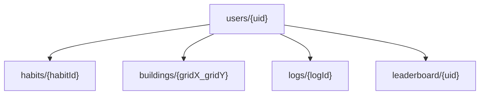

# CivFit – Panduan Main untuk Pemain

Selamat datang di CivFit (Habitoria). Di game ini, progres hidupmu di dunia nyata dipakai untuk membangun peradabanmu di dalam game.

Tujuan utamanya sederhana: jalankan habit secara konsisten, jaga kotamu tetap sehat, dan bawa peradabanmu naik sampai era tertinggi.

---

## Gambaran Singkat

Di CivFit kamu akan:

- Membuat habit harian, mingguan, atau bulanan
- Menyelesaikan habit untuk mendapat Gold, EXP, dan Momentum
- Menggunakan Silver untuk membangun kota
- Menekan End Day untuk memproses pertumbuhan kota, pajak, kesehatan warga, dan progres era

---

## Cara Progres Karakter

### 1. Selesaikan Habit

Setiap habit yang selesai memberi hadiah. Semakin tinggi momentum, hadiahmu makin besar.

Jenis habit:

- Daily: target 1 kali
- Weekly: target 3 kali
- Monthly: target 10 kali

Hadiah dasar saat membuat habit:

- Daily: 10 Gold, 50 EXP
- Weekly: 50 Gold, 250 EXP
- Monthly: 200 Gold, 1000 EXP

Kalau kamu menyelesaikan habit melebihi target periodenya, reward tetap ada tetapi lebih kecil (mode overachievement).

### 2. Naik Level

EXP dipakai untuk naik level. Makin tinggi level, kebutuhan EXP berikutnya makin besar.

- EXP awal untuk level up: 1000
- Setiap naik level, kebutuhan EXP berikutnya naik 20%

### 3. Jaga Momentum

Momentum adalah pengali reward. Momentum naik saat kamu konsisten menyelesaikan habit, dan bisa turun kalau kamu banyak melewatkan habit harian.

---

## Cara Mengelola Kota

Kota berbentuk grid 10x10. Kamu bisa membangun, upgrade, dan menghapus bangunan.

Bangunan aktif saat ini:

- House
- Farm
- Restaurant
- Tax Office
- Coffee Shop
- Medical Clinic
- Clone Center

Setiap bangunan punya efek berbeda ke:

- Kapasitas hunian
- Produksi makanan
- Pemasukan silver
- Kesehatan kota
- Kebahagiaan kota

Bangunan yang di-upgrade jadi lebih kuat. Semakin tinggi level bangunan, semakin besar kontribusinya.

---

## Mata Uang dan Sumber Daya

- Gold: didapat dari habit, dipakai di toko, gacha, dan konversi
- Silver: didapat dari pajak harian kota, dipakai untuk bangun/upgrade
- HP: kondisi karakter pemain
- Momentum: memengaruhi besar reward
- Skip Ticket: perlindungan saat hari buruk

### Kalau Resource Kurang, Apa yang Terjadi?

- Silver kurang: kamu tidak bisa bangun atau upgrade bangunan.
- Gold kurang: kamu tidak bisa beli recovery item, gacha, atau konversi Gold ke Silver.
- HP rendah: tidak langsung game over, tapi kamu makin rentan kena penalti hari buruk karena HP bisa terus turun saat End Day jelek.
- Habit harian banyak gagal: momentum turun, pajak dan stabilitas kota ikut terdampak tidak langsung.

Intinya, Gold dan Silver sama-sama penting, tetapi fungsinya beda. Kehabisan salah satu akan mengunci opsi strategi tertentu.

---

## Toko, Konversi, dan Gacha

### Recovery Item

- Espresso: 50 Gold, +10 HP
- Divine Potion: 200 Gold, +50 HP
- Elysium Ticket: 500 Gold, +100 HP
- Skip Ticket: 1500 Gold, +1 tiket

### Recovery Item Dipakai Otomatis atau Manual?

- Espresso, Divine Potion, dan Elysium Ticket: dipakai manual dari tab Store saat kamu menekan tombol beli item.
- Skip Ticket: dibeli manual, tetapi pemakaiannya otomatis saat End Day jika kondisi gagal berat.

Syarat Skip Ticket terpakai otomatis:

- Kamu punya minimal 1 tiket.
- Habit daily yang tidak selesai lebih dari 50%.

Efek saat tiket otomatis aktif:

- HP berubah jadi `+5` pada End Day tersebut.
- Momentum tidak mendapat penalti tambahan dari skenario gagal berat.
- Jumlah tiket berkurang 1.

### Konversi Silver dan Gold

Kurs berubah mengikuti hari permainan (`dayCount`) dan ada biaya transaksi 5%.

- Silver ke Gold: cocok saat treasury kota berlebih
- Gold ke Silver: cocok saat kamu butuh modal bangun kota

### Fungsi Gold vs Silver dan Pengaruhnya

- Gold berperan untuk sustain karakter dan akselerasi progres personal.
- Silver berperan untuk pertumbuhan kota (infrastruktur, ekonomi, kapasitas).

Pengaruh utama Gold:

- Menjaga HP lewat recovery item.
- Membeli Skip Ticket untuk proteksi hari buruk.
- Membuka peluang boost acak via gacha.
- Menjadi sumber likuiditas darurat saat dikonversi ke Silver.

Pengaruh utama Silver:

- Menentukan seberapa cepat kota bertumbuh karena dipakai untuk bangun/upgrade.
- Mempengaruhi food, housing, health, happiness, dan pendapatan pajak melalui bangunan yang aktif.

Strategi aman:

- Simpan Gold cadangan untuk pemulihan atau tiket.
- Putar Silver untuk menjaga food + housing + health tetap aman agar populasi tidak runtuh.

### Gacha

Biaya 1 pull: 100 Gold.

Peluang hadiah:

- 5%: 500 Gold
- 25%: 1000 Silver
- 30%: 200 EXP
- 40%: 20 HP

---

## End Day: Momen Paling Penting

Setiap menekan End Day, sistem akan menghitung seluruh kondisi harianmu.

Yang diproses:

- Completion habit harian
- Perubahan HP dan momentum
- Pajak silver kota
- Perubahan kesehatan dan kebahagiaan
- Warga sakit, kematian, dan pertumbuhan populasi
- Peluang bencana acak
- Kenaikan era jika syarat populasi terpenuhi

### Ringkasnya

- Main bagus (habit harian tinggi): HP dan momentum cenderung naik, kota stabil, populasi tumbuh
- Main buruk (banyak daily terlewat): HP dan momentum turun, kesehatan/kebahagiaan turun, risiko kematian naik
- Jika kondisi buruk dan kamu punya Skip Ticket, sistem bisa otomatis memakai tiket untuk meredam dampak

---

## Bencana dan Dampaknya

Setiap End Day punya peluang 15% memunculkan bencana acak.

Daftar bencana saat ini:

- Mysterious Plague
- Tremor of Gaia
- Great Drought
- Citizen Unrest

Dampak yang saat ini benar-benar diterapkan sistem:

- Bencana tipe `health` menurunkan kesehatan kota.
- Bencana tipe `happiness` menurunkan kebahagiaan kota.

Catatan penting untuk pemain:

- Bencana muncul secara acak (bukan murni dipicu satu aksi user).
- Tetapi kesalahan user membuat efek bencana jauh lebih berat.
- Contoh kesalahan yang memperburuk dampak: food defisit, housing kurang, terlalu banyak warga sakit, daily habit sering gagal.

Jadi walaupun event acak, kamu tetap bisa "mengurangi kerusakan" dengan manajemen kota dan habit yang konsisten.

---

## Pertumbuhan Penduduk: Apa Saja yang Mempengaruhi?

Penduduk tidak naik otomatis setiap hari. Pertumbuhan terjadi jika kondisi minimal terpenuhi.

Syarat populasi bisa bertambah:

- Kota tidak lapar.
- Health kota di atas 60.
- Kapasitas housing masih ada.

Jika syarat terpenuhi, pertumbuhan dasar:

- `growth = ceil((freeHousing) * 0.1) + 1`

Faktor yang menahan atau menurunkan populasi:

- Food kurang: memicu tambahan warga sakit.
- Housing kurang (tunawisma): memicu tambahan warga sakit.
- Health rendah: meningkatkan death rate.
- Health sangat rendah (<10): ada tambahan kematian dari total populasi.

Aturan kematian dari warga sakit:

- Health < 20: 40% warga sakit bisa meninggal.
- Health < 50: 15%.
- Selain itu: 5%.

Faktor kesehatan dan kebahagiaan dipengaruhi oleh:

- Efek bangunan.
- Efek evolusi yang sudah di-unlock.
- Kualitas performa habit harian (bonus/penalti End Day).
- Kondisi lapar/tunawisma.
- Bencana acak.

Intinya, populasi tumbuh cepat kalau food, housing, health, dan konsistensi habit sama-sama dijaga.

---

## Era Peradaban

Era naik otomatis saat populasi mencapai target:

- Stone Age: 0
- Medieval: 100
- Industrial: 500
- Modern: 2000
- Digital: 10000

Semakin tinggi era, semakin luas peluang strategi kota dan evolusi budaya.

---

## Evolusi Budaya

Kamu bisa membuka cabang evolusi seperti:

- Nomadic
- Agrarian
- Feudal
- Mercantile
- Industrialist
- Modernist
- Cybernetic

Setiap cabang memberi bonus unik (misalnya bonus food, bonus silver, atau bonus stabilitas kota).

---

## Tips Singkat Biar Tidak Ambruk

- Prioritaskan selesaikan daily habit dulu
- Jangan hanya fokus pendapatan; pastikan food dan housing cukup
- Saat warga mulai banyak sakit, segera perkuat sisi health
- Simpan Gold darurat untuk recovery atau skip ticket
- Gunakan End Day secara rutin untuk melihat arah kotamu lebih cepat

---

## Sinkronisasi Mobile

### Local State → Firestore Sync
Semua state game (stats, city, habits, buildings, logs) disimpan di Zustand store dan di-sync secara real-time ke Firestore menggunakan `onSnapshot` listener. Setiap perubahan di Firestore langsung dipantulkan ke UI tanpa perlu refresh.

### Optimistic Update
Aksi seperti menyelesaikan habit, deploy bangunan, atau upgrade bangunan langsung diterapkan ke local state terlebih dahulu (optimistic update). Jika write ke Firestore gagal, state di-rollback ke kondisi sebelumnya.

Contoh:
- `completeHabit()` → local state update → `writeBatch` ke Firestore → rollback jika error.
- `upgradeBuilding()` → optimistic increment level → batch commit → rollback jika gagal.

### Retry on Reconnect
`SyncEngine` (`core/sync/syncEngine.ts`) memiliki antrian offline berbasis SQLite. Aksi yang gagal karena tidak ada koneksi disimpan di tabel `offline_queue` dan di-replay saat koneksi pulih.

### Conflict Resolution
- Firestore security rules memastikan hanya owner yang bisa menulis data miliknya.
- Listener scoped per user dan auto-cleanup saat logout/switch akun untuk mencegah stale data.
- Bangunan dengan koordinat out-of-bound disanitasi otomatis oleh `sanitizeBuildings()`.

---

## Struktur Database Mobile

- **users/{uid}** — dokumen utama berisi `stats` (level, gold, silver, HP, momentum, dll) dan `city` (population, food, housing, health, happiness, era, evolusi).
- **habits/{habitId}** — subcollection berisi daftar habit user. Setiap habit menyimpan `completedDates` (array tanggal ISO) dan `currentStreak`.
- **buildings/{gridX_gridY}** — subcollection berisi bangunan yang ditempatkan di grid 10×10. ID dokumen menggunakan koordinat deterministik untuk mencegah duplikasi tile.
- **logs/{logId}** — subcollection berisi audit trail. Append-only, diurutkan berdasarkan timestamp descending, dibatasi 50 entri per user.
- **leaderboard/{uid}** — collection publik berisi ranking global. Diupdate saat End Day.

---

## Lifecycle Harian

Setiap sesi bermain mengikuti alur berikut:

1. **Login** — Google Sign-In native → Firebase Auth credential exchange → `onAuthStateChanged` fires.
2. **Load city state** — Firestore `onSnapshot` pada `users/{uid}` hydrate stats dan city ke Zustand store.
3. **Load habits** — Listener pada `users/{uid}/habits` memuat daftar habit dan status completion hari ini.
4. **Complete habits** — User menyelesaikan habit → optimistic local update → Firestore batch write. Gold dan EXP langsung ditambahkan.
5. **Calculate rewards** — Reward dihitung berdasarkan base reward × momentum multiplier. Overachievement mengurangi reward 50%.
6. **Update stats** — Stats (gold, exp, level, momentum) diupdate di local state dan di-sync ke Firestore.
7. **Append logs** — Setiap aksi signifikan (complete habit, build, upgrade, end day) menambah entri ke `users/{uid}/logs`.
8. **Update pending report** — Saat End Day ditekan, `processEndDay()` menghasilkan `DayReport` yang disimpan di `stats.pendingReport`.
9. **Sync leaderboard** — End Day menulis snapshot level, population, dan era ke `leaderboard/{uid}`.

---

## Konsistensi Data

### Buildings sebagai Source of Truth untuk City Layout
Bangunan disimpan di subcollection terpisah (`buildings/`) dengan ID berbasis koordinat. City state di dokumen user hanya menyimpan agregat (total housing, food, dll). Layout aktual selalu dihitung dari subcollection buildings melalui `calculateCitySummary()`.

### Logs sebagai History Only
Logs bersifat append-only dan tidak pernah dimodifikasi. Mereka berfungsi sebagai audit trail untuk menampilkan riwayat aksi. Query dibatasi 50 entri terakhir untuk performa.

### Habits Menyimpan Completion State
Setiap habit menyimpan `completedDates` (array string ISO) dan `currentStreak`. Status "selesai hari ini" ditentukan dengan mengecek apakah `day-{dayCount}` ada di array `completedDates`.

### Users Menyimpan Aggregate Progression
Dokumen user berisi `stats` (level, gold, silver, HP, momentum, dayCount) dan `city` (population, health, happiness, era). Agregat ini diupdate oleh `processEndDay()` dan sinkronisasi Firestore. Ini memungkinkan single-read hydration tanpa perlu join.

---

## Penutup

CivFit bukan cuma soal kota besar, tapi soal konsistensi kecil setiap hari.

Jaga ritme habitmu, dan peradabanmu akan ikut tumbuh.