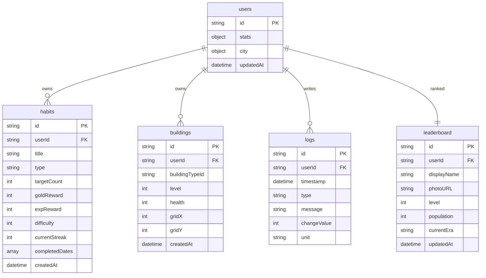
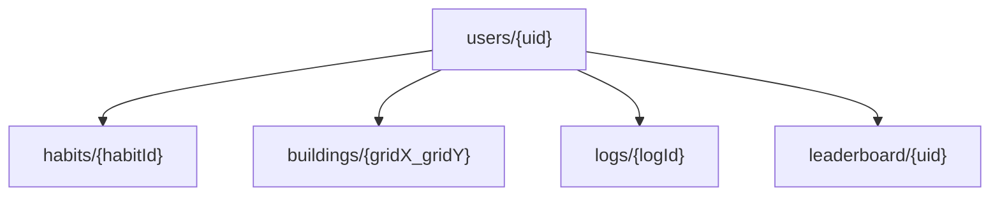

# Habitoria Mobile

Habitoria Mobile is the native/mobile-first implementation of Habitoria, focusing on habit progression, civilization simulation, and persistent cross-device gameplay.

---

## Overview

Habitoria is a mobile-first productivity game that turns real-life habit completion into civilization growth. Every habit you complete fuels your character's progression and your city's development.

- **Mobile-first habit tracking** — create, complete, and manage daily/weekly/monthly habits from a native interface with haptic feedback and animated UI.
- **Offline-friendly Firestore sync** — a sync engine queues actions locally via SQLite and replays them when connectivity resumes. Firestore listeners keep the UI reactive.
- **Persistent city progression** — city state (population, buildings, era, resources) is stored in Firestore subcollections and hydrated on every session.
- **Cross-platform account compatibility** — Google Sign-In via `@react-native-google-signin/google-signin` with Firebase Auth credential exchange. Same account works across mobile and web.

---

## Core Features

### Authentication
- Native Google Sign-In using `@react-native-google-signin/google-signin` (v16).
- Firebase Auth credential exchange via `GoogleAuthProvider.credential(idToken)` + `signInWithCredential()`.
- Auth state managed by `onAuthStateChanged()` listener in the Zustand store.
- Sign-out and account deletion (with full Firestore subcollection cleanup) from the Menu screen.

### Habit System
- **Daily** (target: 1x), **Weekly** (target: 3x), **Monthly** (target: 10x) habit types.
- **Habit completion** — each completion grants Gold + EXP immediately (optimistic update).
- **Streak tracking** — `currentStreak` increments on each completion and resets on missed daily habits during End Day.
- **Reward scaling** — base rewards scale with `momentum` multiplier. Overachievement (exceeding period target) halves the reward.

| Habit Type | Base Gold | Base EXP | Target |
|------------|-----------|----------|--------|
| Daily      | 10        | 50       | 1x     |
| Weekly     | 50        | 250      | 3x     |
| Monthly    | 200       | 1000     | 10x    |

### EXP & Level Progression
- Starting EXP threshold: **1000 EXP per level**.
- Each level-up increases the next threshold by **20%**.
- Level is tracked globally and unlocks evolution branches and building eras.

### HP System
- Default HP: **100** (max HP).
- HP changes during **End Day** based on daily habit completion rate:
  - ≥80% completion: **+10 HP**.
  - <80% completion: penalty scaled by number of missed dailies (max 25% of maxHP).
- HP can be restored via **recovery items** purchased with Gold in the Store.

### Momentum System
- Ranges from **0–100**.
- Acts as a reward multiplier: `finalReward = baseReward × (1 + (momentum / 100) × 0.5)`.
- Increases by **+2** per habit completion, **+5** on good End Day (≥80%), decreases on bad days.
- Affects silver tax income: `taxes = baseSilverIncome × (0.8 + (momentum / 100) × 0.4)`.

### Gold & Silver Economy
- **Gold** — earned from habits. Spent on recovery items, gacha pulls, currency exchange, and special buildings.
- **Silver** — earned from daily city taxes during End Day. Spent on building construction and upgrades.
- Currency exchange available in Store with a **5% transaction fee** and dynamic rate based on `dayCount`.

### City Simulation
- **10×10 grid** for building placement with coordinate-based deterministic IDs (`{gridX}_{gridY}`).
- Building types span 5 eras: House, Farm, Restaurant, Tax Office, Coffee Shop, Medical Clinic, Clone Center.
- Each building affects: housing, food production, silver income, health bonus, happiness bonus.
- Building costs scale with total building count: `cost = baseCost × (1 + totalBuildings × 0.05) × evolutionMultiplier`.

### Building Upgrades
- Buildings can be upgraded to increase their output by **+20% per level**.
- Upgrade cost: silver only, scaling per building.
- Optimistic UI update with rollback on Firestore failure.

### Era Progression
- Era advances automatically during End Day when population reaches the next milestone:

| Era        | Min Population | Min Level |
|------------|---------------|-----------|
| Stone Age  | 0             | 1         |
| Medieval   | 100           | 5         |
| Industrial | 500           | 15        |
| Modern     | 2000          | 30        |
| Digital    | 10000         | 50        |

### Event System
- **15% chance** of a random disaster during each End Day.
- Current disasters: Mysterious Plague, Tremor of Gaia, Great Drought, Citizen Unrest.
- Disasters affect city health or happiness based on `impactType` and `severity`.
- When a disaster occurs, an **emergency mitigation habit** is auto-created.

### Daily Reports
- End Day generates a `DayReport` containing: habits completed/total, gold/exp gained, HP change, city health/happiness change, silver tax, population growth, deaths, events.
- Report is stored in `stats.pendingReport` and displayed via an overlay.

### Leaderboard
- Public ranking stored at `leaderboard/{uid}`.
- Updated during End Day with current level, population, era, and display name.
- Readable by all signed-in users, writable only by the owner.

### Skip Ticket
- Purchased with Gold (1500 Gold each).
- Auto-consumed during End Day if >50% of daily habits are missed.
- Effect: HP change becomes +5, momentum penalty is waived.

### Gacha
- Cost: **100 Gold** per pull.
- Rewards: 5% chance 500 Gold, 25% chance 1000 Silver, 30% chance 200 EXP, 40% chance 20 HP.

### Evolution Branches
- Unlockable cultural paths: Nomadic, Agrarian, Feudal, Mercantile, Industrialist, Modernist, Cybernetic.
- Each requires specific level + building prerequisites.
- Grants permanent bonuses (cost reduction, food boost, tax bonus, etc.).

---

## Mobile Architecture

### Routing (Expo Router)
```
app/
├── index.tsx          → Auth gate (Redirect to /login or /tabs)
├── splash.tsx         → Loading screen during auth hydration
├── _layout.tsx        → Root Stack + providers + theme
├── (auth)/
│   ├── _layout.tsx    → Auth stack (no header, no gesture)
│   └── login.tsx      → Login screen wrapper
├── (tabs)/
│   ├── _layout.tsx    → Tab navigator + Header
│   ├── index.tsx      → Realita (habits)
│   ├── city.tsx       → Kota (city simulation)
│   ├── shop.tsx       → Toko (store)
│   └── menu.tsx       → Menu (profile/settings)
└── onboarding/        → Onboarding flow (6 slides)
```

### State Management
- **Zustand** (`core/progression/store.ts`) — single source of truth for all game state.
- `onAuthStateChanged()` listener triggers Firestore `onSnapshot` subscriptions for real-time data.
- User-scoped listeners (habits, buildings, logs, profile) are auto-subscribed on login and unsubscribed on logout.

### Service Layer
| Module | Responsibility |
|--------|---------------|
| `services/firebase/index.ts` | Firebase app init, Auth setup with RN persistence, Firestore instance |
| `services/firebase/firestoreUtils.ts` | User profile init, onboarding completion |
| `services/firebase/activity.ts` | Last-active tracking (throttled to 1x/day) |
| `core/sync/syncEngine.ts` | Offline action queue via SQLite, replay on reconnect |
| `core/progression/engine.ts` | End Day processing (pure function) |
| `core/simulation/cityUtils.ts` | City summary calculation, building sanitization |

### Auth Flow
```
Google Sign-In (native SDK)
    ↓ idToken
GoogleAuthProvider.credential(idToken)
    ↓ credential
signInWithCredential(auth, credential)
    ↓ user
initUserProfile(uid) → Firestore read/write
    ↓
onAuthStateChanged → Zustand store update
    ↓
Firestore onSnapshot subscriptions hydrate state
    ↓
router.replace('/(tabs)') or router.replace('/onboarding')
```

### Local Caching & Sync
- **Firebase Auth persistence** via `@firebase/auth` React Native persistence (AsyncStorage-backed).
- **Firestore `onSnapshot`** provides real-time reactive updates.
- **SyncEngine** queues write actions in a local SQLite `offline_queue` table and replays them when online.
- **Optimistic updates** — state is updated locally before Firestore write confirms (e.g., `completeHabit`, `upgradeBuilding`).

---

## Firestore Structure



## Firestore Virtual Structure



- **Buildings** use deterministic coordinate IDs (`{gridX}_{gridY}`) — prevents duplicate placements on the same tile.
- **Habits** are state storage — `completedDates` array tracks which days a habit was done; `currentStreak` tracks consecutive completions.
- **Logs** are an immutable audit trail — append-only, ordered by timestamp descending, capped at 50 entries per user.

---

## Mobile Sync Rules

- **Firestore is the source of truth.** All game state is hydrated from Firestore `onSnapshot` listeners. Local Zustand state mirrors Firestore data.
- **Mobile reads canonical building IDs** from `users/{uid}/buildings` subcollection. Buildings with out-of-bound coordinates are sanitized at read time (`sanitizeBuildings()`).
- **Web compatibility is supported** — the same Firestore schema is used by both mobile and web clients. The `platform/storage/storage.ts` abstraction layer switches between AsyncStorage (mobile) and localStorage (web).
- **Offline writes sync later** — the `SyncEngine` queues write actions in a local SQLite `offline_queue` table and replays them when connectivity is restored.
- **Conflict prevention** — optimistic updates are applied locally first, then confirmed by Firestore. On failure, state is rolled back (e.g., building upgrade rollback on batch commit failure). Firestore security rules enforce owner-only writes.

---

## Installation

### Prerequisites
- Node.js 18+
- Expo CLI (`npm install -g expo-cli`)
- Android Studio (for local emulator)
- A Firebase project with Google Sign-In enabled

### Setup

```bash
# Clone and install dependencies
git clone <repo-url>
cd CivFit
npm install

# Configure environment variables
cp .env.example .env
# Edit .env with your Firebase and Google OAuth credentials:
#   EXPO_PUBLIC_GOOGLE_WEB_CLIENT_ID=<your-web-client-id>
#   EXPO_PUBLIC_GOOGLE_ANDROID_CLIENT_ID=<your-android-client-id>

# Place google-services.json in project root (from Firebase Console)

# Start development server
npx expo start

# Run on Android emulator
npx expo run:android

# Build release APK (via EAS)
npx eas build --platform android --profile preview

# Build production AAB
npx eas build --platform android --profile production
```

### Firebase Configuration
1. Enable **Google** provider in Firebase Authentication.
2. Register Android app with package name `com.dakocreative.habittracker`.
3. Add SHA-1 fingerprints for both debug and release keystrokes.
4. Download `google-services.json` to project root.
5. Deploy Firestore rules: `firebase deploy --only firestore:rules`.

---

## Development Notes

### Backward Compatibility with CivFit Data
- The project was originally named "CivFit" and retains the package name `com.dakocreative.habittracker`.
- The `google-services.json` contains entries for both the legacy `com.anonymous.CivFit` (Expo Go) and the production `com.dakocreative.habittracker` package names.

### Schema Normalization
- Buildings are stored in a **subcollection** (`users/{uid}/buildings`) instead of being embedded in the user document. This was migrated from the original embedded model.
- City state (`city` object) and stats (`stats` object) remain embedded in the user document for single-read hydration.
- The `sanitizeBuildings()` utility filters out any buildings with out-of-bound grid coordinates (legacy data from before grid validation was added).

### Migration-Safe Patterns
- Storage schema versioning via `checkStorageVersion()` in `platform/storage/hydration.ts` — runs migrations on app launch if the local schema version is outdated.
- Era normalization handles legacy values (e.g., `'MEDIEVALedieval'` → `Era.MEDIEVAL`).
- Firestore listeners are scoped per user and auto-cleaned on logout/account switch to prevent stale data leaks.
